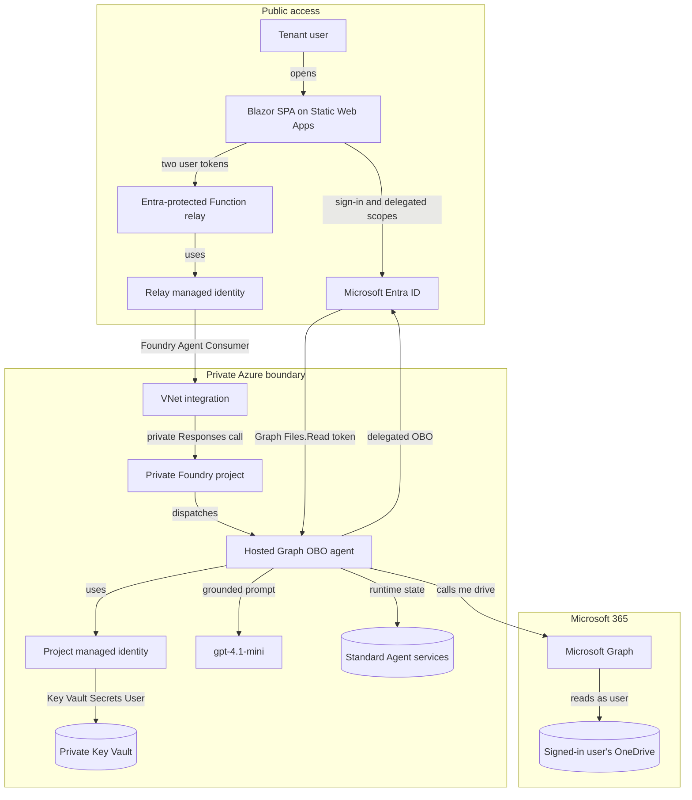
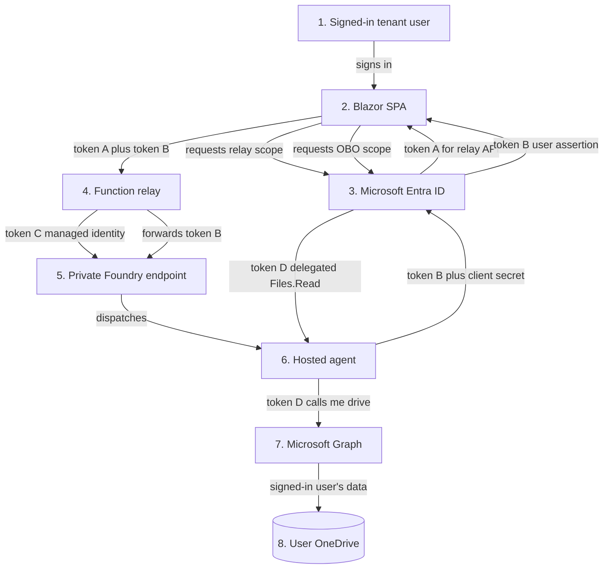
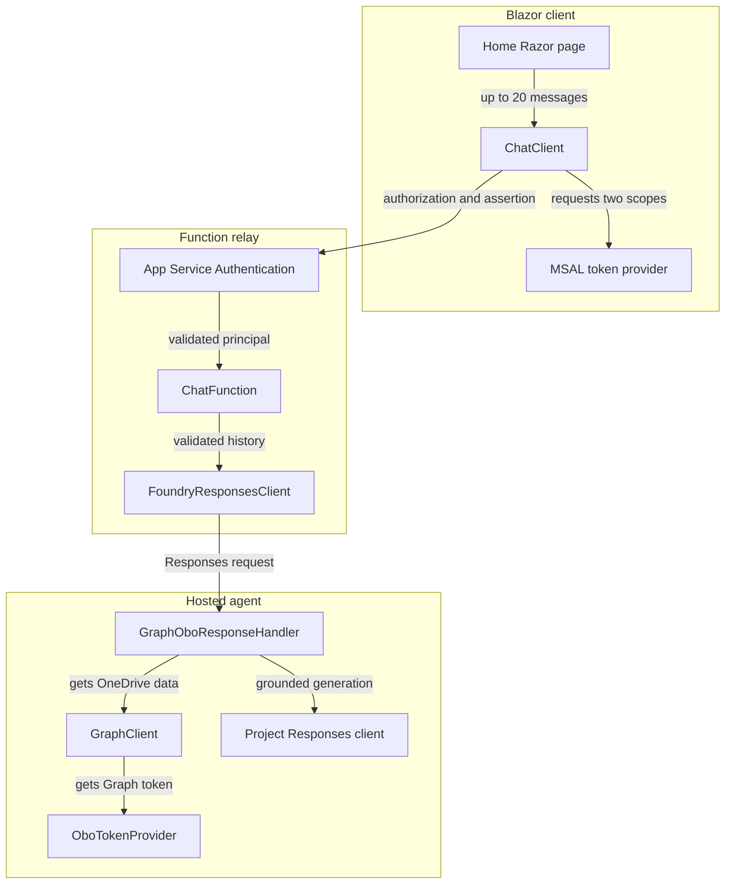

# Microsoft Foundry Hosted Graph OBO Agent

This repository contains a deployed .NET 10 Microsoft Foundry hosted agent and a public Blazor WebAssembly chat client. The agent retrieves the signed-in user's OneDrive root folders through delegated Microsoft Graph On-Behalf-Of (OBO) access.

> **Key point:** tenant-wide admin consent pre-authorizes delegated Graph `Files.Read`. It does not convert this solution to app-only access. Every OneDrive request still requires a signed-in user's assertion.

## Inspiration and acknowledgements

This project was inspired by Mauro Minella's article, [Building a Microsoft Foundry Hosted Agent that calls Microsoft Graph On Behalf Of the User](https://medium.com/@minella.mauro/building-a-microsoft-foundry-hosted-agent-that-calls-microsoft-graph-on-behalf-of-the-user-48e5aa6aa92d), and its companion [`hosted_agents` reference implementation](https://github.com/maurominella/hosted_agents/blob/main/agents/README.md).

Special thanks to **Mauro Minella** for publishing the original design, implementation guidance, and reusable example that provided the foundation for this project.

## Architecture

The browser and relay are public, but the Foundry project, hosted agent, Key Vault, and Standard Agent data services stay behind private connectivity.



Security boundaries:

- App Service Authentication protects the relay; managed identity authorizes the relay to Foundry.
- The hosted agent performs OBO and reads its confidential-client credential from private Key Vault.
- Tokens remain outside model input and output. Only retrieved OneDrive data is supplied for grounded generation.

## Token flow at a glance



| Token | Represents | Audience | Purpose |
| --- | --- | --- | --- |
| A | Signed-in user | Relay API | Authorizes the public `/api/chat` call |
| B | Signed-in user | OBO API | User assertion forwarded to the hosted agent |
| C | Relay workload | Microsoft Foundry | Lets the relay invoke the private agent |
| D | Signed-in user | Microsoft Graph | Delegated `Files.Read` token created by OBO |

Token D is the OBO result. Admin consent pre-authorizes its delegated scope but token D cannot be issued without token B from a signed-in user.

### Tenant admin consent preserves OBO

This is still a delegated OBO flow even though a tenant administrator granted consent:

- The administrator granted the **delegated** Microsoft Graph `Files.Read` scope to the OBO enterprise application for all users in the tenant (`AllPrincipals`).
- Admin consent removes repeated user consent prompts; it does not change the permission type to application access.
- Every Graph request still starts with token B from a signed-in user.
- Entra issues token D only after validating token B, the OBO application's confidential-client credential, tenant, audience, and delegated grant.
- Token D represents that user, and Graph `/me` resolves to that user's OneDrive.
- Without a valid user assertion, the OBO exchange fails. The agent cannot use the admin grant alone to call Graph.

In short: **the tenant admin approves who may use the delegated flow; the signed-in user remains the identity and authorization boundary for each request.**

### Why `x-client-user-token` is used

`x-client-user-token` is an application-defined transport header for **token B**, the signed-in user's OBO API assertion. It is not an Azure platform authentication header and it is not sent to Microsoft Graph.

Microsoft documents the `x-client-*` prefix as the supported way to forward caller-defined headers unchanged through the Foundry gateway to a hosted-agent container. Microsoft does **not** define `x-client-user-token` specifically; this solution defines that name and owns its validation and OBO semantics. Foundry neither authenticates nor interprets its value. The gateway does not forward the caller's normal `Authorization` header, so token B must use a separate `x-client-*` header while `Authorization` authenticates each immediate hop. See [Hosted agent runtime contract - Forward custom request headers to your container](https://learn.microsoft.com/azure/foundry/agents/concepts/hosted-agent-contract#forward-custom-request-headers-to-your-container).

| Hop | `Authorization` header | `x-client-user-token` header |
| --- | --- | --- |
| Browser to relay | Token A authenticates the user to the relay API | Token B carries the assertion intended for OBO |
| Relay to Foundry | Token C authenticates the relay managed identity to Foundry | The relay forwards token B unchanged |
| Hosted agent to Graph | Token D authenticates the delegated user to Graph | Not sent |

The separate header is required because one bearer token cannot have two audiences:

- `Authorization` authenticates the immediate caller at each network boundary.
- `x-client-user-token` transports the user assertion to the component that performs OBO.
- The relay does not exchange or inspect token B; App Service Authentication validates token A.
- The hosted agent reads token B from `ResponseContext.ClientHeaders`, exchanges it through MSAL, and uses the resulting token D for Graph.
- Token B is kept out of chat history, model input, prompts, responses, and deliberate application logging.

The header name is configured by `CLIENT_USER_TOKEN_HEADER` in [`azure.yaml`](azure.yaml). Its implementation is visible in [`ChatClient.cs`](src/PublicChat/Client/ChatClient.cs), [`FoundryResponsesClient.cs`](src/PublicChat/Relay/GraphOboRelay/FoundryResponsesClient.cs), and the hosted agent [`Program.cs`](src/HostedOBOAgent/Program.cs).

## Key token-flow code

### 1. SPA acquires token A and token B

The browser requests one delegated token per API audience:

```csharp
var functionToken = await tokenProvider.RequestAccessToken(
    new AccessTokenRequestOptions { Scopes = [functionScope] })
    .AsTask()
    .WaitAsync(TimeSpan.FromSeconds(30));

var oboToken = await tokenProvider.RequestAccessToken(
    new AccessTokenRequestOptions { Scopes = [oboScope] })
    .AsTask()
    .WaitAsync(TimeSpan.FromSeconds(30));
```

It uses token A for relay authentication and transports token B separately:

```csharp
request.Headers.Authorization = new("Bearer", functionAccessToken.Value);
request.Headers.Add("x-client-user-token", oboAccessToken.Value);
```

Source: [`ChatClient.cs`](src/PublicChat/Client/ChatClient.cs)

### 2. Relay acquires token C and forwards token B

The relay is pinned to its user-assigned managed identity:

```csharp
return new DefaultAzureCredential(
    new DefaultAzureCredentialOptions { ManagedIdentityClientId = clientId });
```

It authenticates to Foundry with token C while preserving token B as the OBO assertion:

```csharp
var accessToken = await credential.GetTokenAsync(
    new TokenRequestContext(["https://ai.azure.com/.default"]),
    cancellationToken);

request.Headers.Authorization =
    new AuthenticationHeaderValue("Bearer", accessToken.Token);
request.Headers.Add("x-client-user-token", userAssertion);
```

Sources: relay [`Program.cs`](src/PublicChat/Relay/GraphOboRelay/Program.cs) and [`FoundryResponsesClient.cs`](src/PublicChat/Relay/GraphOboRelay/FoundryResponsesClient.cs)

### 3. Hosted agent reads token B outside model input

The assertion comes from request context, never from the chat message:

```csharp
var userAssertion = context.ClientHeaders.TryGetValue(
    options.UserTokenHeaderName,
    out var assertion)
        ? assertion
        : null;
```

Source: hosted agent [`Program.cs`](src/HostedOBOAgent/Program.cs)

### 4. Hosted agent exchanges token B for token D

MSAL combines the user assertion with the confidential-client credential from Key Vault:

```csharp
var secret = await secretClient.GetSecretAsync(
    options.OboClientSecretName,
    cancellationToken: cancellationToken);

var application = ConfidentialClientApplicationBuilder
    .Create(options.OboClientId)
    .WithAuthority(AzureCloudInstance.AzurePublic, options.OboTenantId)
    .WithClientSecret(secret.Value.Value)
    .Build();

var result = await application
    .AcquireTokenOnBehalfOf(
        ["https://graph.microsoft.com/.default"],
        new UserAssertion(userAssertion))
    .ExecuteAsync(cancellationToken);
```

Source: [`OboTokenProvider.cs`](src/HostedOBOAgent/OboTokenProvider.cs)

### 5. Graph uses token D as the signed-in user

The delegated Graph token calls `/me`, binding the request to the user represented by token D:

```csharp
using var request = new HttpRequestMessage(
    HttpMethod.Get,
    "https://graph.microsoft.com/v1.0/me/drive/root/children" +
    "?$select=name,folder,size,lastModifiedDateTime");

request.Headers.Authorization =
    new AuthenticationHeaderValue("Bearer", graphToken);
```

Source: [`GraphClient.cs`](src/HostedOBOAgent/GraphClient.cs)

## Application components



## Deployed resources

| Resource | Value |
| --- | --- |
| Subscription | `b651dacd-e6f5-465b-a17c-25f3a2cdd0c8` |
| Resource group | `rg-fdr-obo-private-gerwc` |
| Private resource region | Germany West Central |
| Static Web Apps region | West Europe |
| Private Foundry account | `fdrpobo5mgq` |
| Private Foundry project | `fdr-svc-project5mgq` |
| Project endpoint | `https://fdrpobo5mgq.services.ai.azure.com/api/projects/fdr-svc-project5mgq` |
| Private Key Vault | `kv-fdr-obo-5mgq` |
| VNet | `vnet-fdr-obo-private-gerwc` |
| Hosted agent | `graph-obo-dotnet-agent`, version `3` |
| Blazor WASM client | `https://thankful-smoke-023f1f703.7.azurestaticapps.net/` |
| Entra-protected relay | `https://func-api-mltnqc4mt47uc.azurewebsites.net/api/chat` |

The Standard Agent setup, Storage, Azure AI Search, Cosmos DB, Key Vault, and Foundry endpoint remain private. The application has no custom database and does not query Cosmos DB directly; Cosmos DB is infrastructure used by the Standard Agent foundation. The public client never has direct network access to these resources.

## Projects

| Path | Purpose |
| --- | --- |
| [HostedOBOAgent](src/HostedOBOAgent) | Foundry Responses-protocol hosted agent. |
| [Client](src/PublicChat/Client) | Tenant-only Blazor WebAssembly chat client. |
| [GraphOboRelay](src/PublicChat/Relay/GraphOboRelay) | Entra-protected Functions Flex Consumption relay. |
| [Relay IaC](src/PublicChat/Relay/infra) | Template-derived Bicep for the Function, VNet integration, private runtime storage, observability, Static Web Apps, and Foundry RBAC. |

## Chat Experience

- Responsive chat layout with accessible message bubbles, loading and error states, starter prompts, and a new-conversation action.
- Multi-turn conversations send up to 20 user/assistant messages through the relay so follow-up questions retain context.
- The browser extracts and renders only the assistant's `output_text`, rather than exposing the Foundry response envelope.
- The agent formats storage values as readable KB, MB, or GB values by default.
- Static Web Apps rewrites client routes to `index.html`, including the MSAL login callback.

## Required Identity and Consent Configuration

| Principal | ID | Permission | Scope |
| --- | --- | --- | --- |
| SPA | `e893f7b5-77de-488c-9ba7-bdd91d18f3a6` | Relay API `access_as_user` | Delegated |
| SPA | `e893f7b5-77de-488c-9ba7-bdd91d18f3a6` | OBO API `access_as_user` | Delegated |
| OBO application | `80993359-7978-4ded-804c-c70f2374bcab` | Microsoft Graph `Files.Read` | Delegated with tenant admin consent |
| Relay managed identity | Principal `1cc7d5d2-7419-4c19-a5f4-adcb98db7a98` | Foundry Agent Consumer | Foundry account |
| Foundry project identity | Principal `b41a14be-4cba-482f-a3f8-3a6a36bae896` | Key Vault Secrets User | `kv-fdr-obo-5mgq` |

### Delegated consent, RBAC, and credentials are different

| System | Applies to | Role in this solution |
| --- | --- | --- |
| OAuth delegated scopes | Signed-in user plus API | `access_as_user` and Graph `Files.Read` define what may be done on behalf of the user |
| Azure RBAC | Managed identities plus Azure resources | Foundry Agent Consumer and Key Vault Secrets User authorize workload access |
| Confidential-client credential | OBO application identity | The Key Vault secret proves the hosted agent is the trusted OBO client |

Admin consent sets the delegated Graph `Files.Read` grant to `AllPrincipals` for this tenant, avoiding a consent prompt for every user. It does not create an application permission, cannot issue a Graph token without token B, cannot select another user, and does not bypass the permissions of the signed-in user resolved by `/me`.

## Fork additions: private-network infrastructure

This fork adds the infrastructure needed to deploy the whole solution — VNet,
Foundry, Key Vault, and hosted agent — with `publicNetworkAccess=Disabled`:

| Path | Purpose |
| --- | --- |
| [`infra/foundry-private`](infra/foundry-private) | Vendored, parameterized copy of the official [`15-private-network-standard-agent-setup`](https://github.com/microsoft-foundry/foundry-samples/tree/main/infrastructure/infrastructure-setup-bicep/15-private-network-standard-agent-setup) template: BYO VNet, private-endpoint Standard Agent Setup (Cosmos DB, AI Search, Storage), System Assigned Managed Identity. |
| [`infra/deployment-tools`](infra/deployment-tools) | Vendored `preflight` and `cleanup` helpers from the same template family. |
| [`infra/jumpbox`](infra/jumpbox) | New: Windows VM + Azure Bastion. Required because once the Foundry account is network-isolated, every `azd`/`az` command against the project data plane must originate from inside the VNet. |
| [`docs/sequence-diagram.md`](docs/sequence-diagram.md) | Full deployment sequence diagram plus the OBO token-exchange sequence and condensed repro steps. |

See [`docs/sequence-diagram.md`](docs/sequence-diagram.md) for the exact order
of operations and the OBO token flow once the private plane is live.

## Validation

Detailed deployment decisions and historical evidence are in the [deployment plan](.azure/deployment-plan.md).

```powershell
dotnet build .\HostedOBOAgent.slnx --no-restore
dotnet build .\src\PublicChat\Client\PublicChat.Client.csproj --no-restore
dotnet build .\src\PublicChat\Relay\GraphOboRelay\GraphOboRelay.csproj --no-restore
az bicep build --file .\src\PublicChat\Relay\infra\main.bicep
```

Deployment verification completed:

- The private VM resolved both the Foundry project and Key Vault to private IP addresses.
- The hosted agent `graph-obo-dotnet-agent` version `3` is active and responded to a private VNet smoke test.
- The Foundry project system identity has Key Vault Secrets User on `kv-fdr-obo-5mgq`.
- The Function relay returns `401` without a valid Entra token.
- The Static Web App redirects unauthenticated users to the configured tenant Microsoft Entra sign-in endpoint.
- The Function relay identity has Foundry Agent Consumer at the Foundry account scope.
- End-to-end browser validation completed successfully. Response `caresp_c113f181386adad800buwQQqAHoFBLmkl4bs6gHXPUcYsPthPl` completed and returned only the signed-in user's OneDrive root folders and sizes.
- The redesigned client passed a live two-turn browser test: the first turn rendered human-readable MB/KB values, and a follow-up correctly compared the two largest folders using conversation history.
- The SPA authentication callback returns `200`, the unauthenticated relay returns `401`, and the allowed-origin CORS preflight returns `204`.

To repeat user-specific OBO validation, sign in at the public client endpoint and ask: `List my OneDrive root folders and their sizes.` The response must contain only the signed-in user's data.

## License

This project is licensed under the [MIT License](LICENSE).
