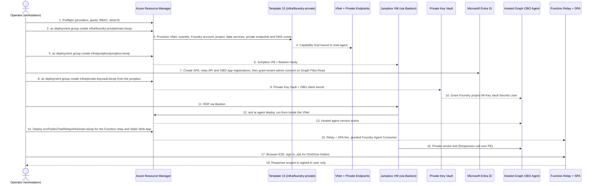
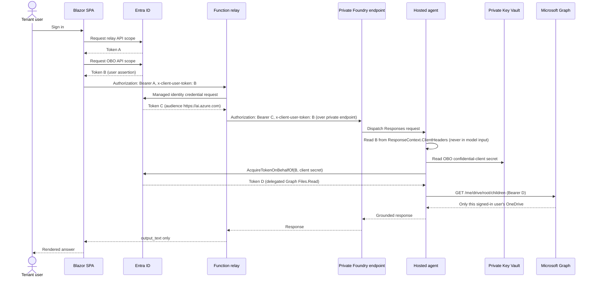

# Private (VNet-Injected) Deployment — Sequence and Steps

This document records the end-to-end sequence for standing up
`HostedOBOAgent` fully on a private network: VNet-injected Microsoft Foundry
(Standard Agent Setup), a private Key Vault, a jumpbox + Azure Bastion for
private access, the hosted Graph OBO agent, and the public relay/SPA.

Full narrative plan: see the fork's session plan; this file is the durable,
in-repo record of *what was run, in what order, and why*.

## 1. Deployment sequence (infra → app → validation)



## 2. OBO token exchange (per-request, once everything is live)



| Token | Subject | Audience | Purpose |
| --- | --- | --- | --- |
| A | Signed-in user | Relay API | Authorizes the public `/api/chat` call |
| B | Signed-in user | OBO API app | User assertion forwarded via `x-client-user-token` |
| C | Relay managed identity | `https://ai.azure.com` | Lets the relay call the private Foundry endpoint |
| D | Signed-in user | Microsoft Graph | Delegated `Files.Read`, produced by the OBO exchange |

## 3. Repro steps (condensed)

1. **Preflight** — confirm Owner/User Access Administrator rights; register
   `Microsoft.KeyVault`, `Microsoft.CognitiveServices`, `Microsoft.Storage`,
   `Microsoft.Search`, `Microsoft.Network`, `Microsoft.App`,
   `Microsoft.ContainerService`; check `gpt-4.1-mini` quota in the target
   region; run `infra/deployment-tools/preflight`.
2. **Deploy the private Foundry foundation**:
   ```powershell
   az deployment group create -g <rg> -f infra/foundry-private/main.bicep -p infra/foundry-private/main.bicepparam
   ```
3. **Deploy the jumpbox + Bastion**:
   ```powershell
   az deployment group create -g <rg> -f infra/jumpbox/jumpbox.bicep -p infra/jumpbox/jumpbox.bicepparam adminPassword=$env:JUMPBOX_ADMIN_PASSWORD
   ```
4. **Create Entra registrations** (SPA, relay API, OBO confidential client)
   and grant tenant admin consent on delegated Graph `Files.Read`.
5. **Deploy the private Key Vault** and store the OBO client secret:
   ```powershell
   az deployment group create -g <rg> -f infra/private-keyvault.bicep -p vaultName=<kv> vnetName=vnet-hostedobo-wus3 privateEndpointSubnetName=snet-pe operatorObjectId=<id> oboClientSecret=$env:OBO_CLIENT_SECRET
   ```
6. **Deploy the hosted agent from inside the VNet** (RDP to the jumpbox via
   Bastion first):
   ```powershell
   azd env set AZURE_AI_MODEL_DEPLOYMENT_NAME gpt-4.1-mini
   azd env set KEY_VAULT_URL https://<kv>.vault.azure.net/
   azd env set APP_OBO_TENANT_ID <tenant>
   azd env set APP_OBO_CLIENT_ID <client>
   azd env set APP_OBO_CLIENT_SECRET_NAME APP-OBO-CLIENT-SECRET
   azd ai agent deploy
   ```
7. **Deploy the relay + SPA** from `src/PublicChat/Relay`:
   ```powershell
   azd deploy --no-prompt
   ```
8. **Validate**: private DNS resolution from the jumpbox, `401` from the relay
   with no token, `204` on CORS preflight, and a signed-in browser test asking
   `List my OneDrive root folders and their sizes.` — confirm the answer is
   scoped to that user only.

## Known operational gotchas

- Template 15 does **not** put agent *tools* behind the VNet; this agent calls
  Microsoft Graph directly so that's not needed here.
- A failed capability-host deployment leaves a `legionservicelink` on the
  agent subnet. Simplest retry: redeploy with a new VNet name.
- Every `azd`/`az`/SDK call against the project data plane must run from
  inside the VNet once `publicNetworkAccess` is `Disabled` — Foundry MCP
  tooling cannot reach it at all.

## Live deployment log (executed end to end against a real subscription)

Deployed to `rg-hostedobo-private-wus3` / `westus3` /
subscription `c8a35425-69fe-4a90-bf45-4475c0adb74a`.

| Step | Outcome |
| --- | --- |
| Preflight | 20/20 checks passed (`infra/deployment-tools/preflight/preflight-check.ps1`) |
| `infra/foundry-private` | **Succeeded.** `fdrobowus3uok4` (`publicNetworkAccess: Disabled`, agent injection into `snet-agent`), project `obo-projectuok4`, Cosmos DB, AI Search, Storage, ACR, App Insights, 8 private DNS zones, 4 private endpoints — all confirmed via `az resource list` / `az cognitiveservices account show`. |
| Entra registrations | 3 apps created + tenant-admin-consented (see plan doc for IDs). |
| `infra/jumpbox` | **Succeeded**, after two fixes discovered during live deployment (see below). Bastion `bas-hostedobo-wus3` + VM `vm-obo-jump` running. |
| `infra/private-keyvault.bicep` | **Succeeded.** `kv-hostedobo-uok4`, OBO secret stored, **project's** system-assigned identity (not the account's) granted `Key Vault Secrets User`. |
| `azd ai agent init` / `azd deploy` (hosted agent) | **Blocked.** See below. |

### Fixes required to `infra/jumpbox/jumpbox.bicep` during live deployment

1. **VM size capacity.** The sandbox subscription had no capacity for
   `Standard_D2s_v5`, `Standard_D2s_v4`, or `Standard_B2s` in `westus3`.
   Resolved by querying `az vm list-skus -l westus3 --resource-type
   virtualMachines` for a SKU with an empty `restrictions` array and switching
   to `Standard_D2s_v7`. Re-run this query in any new subscription/region —
   available sizes vary.
2. **Image reference.** `MicrosoftWindowsDesktop/windows-11/win11-23h2-pro`
   is not published in every region/subscription. Switched to
   `MicrosoftWindowsServer/WindowsServer/2022-datacenter-azure-edition`, which
   is broadly available and sufficient for a jumpbox.
3. **Computer name length.** Windows `computerName` must be ≤15 characters.
   `vm-hostedobo-jump` (18 chars) failed; renamed to `vm-obo-jump` (11 chars).

### Automating the jumpbox without interactive RDP

All in-VM setup (git, .NET 10 SDK, Azure CLI, `azd` + `azure.ai.agents`
extension install, repo clone, build, `az login --identity`) was done with
`az vm run-command invoke`, which executes over the VM-agent control channel
and works even though the VM has no public IP and `publicNetworkAccess` is
disabled everywhere else. This avoided needing an interactive Bastion RDP
session for routine setup. The VM was given a system-assigned managed
identity with `Contributor` (resource group), `AcrPush` (the ACR), and
`Cognitive Services Contributor` (the Foundry account) so `az login
--identity` and `azd auth login --managed-identity` both succeed and
`azd auth token` returns a valid ARM token from inside the VNet.

### Known blocker: `azd ai agent init`/`deploy` rejects managed-identity auth

With `azd auth login --managed-identity` successfully completed and
`azd auth token` returning a valid token, `azd ai agent init --project-id
<resource-id> --no-prompt` still fails with `ERROR: not logged in`. This
reproduces consistently and appears to be a limitation of the beta
`azure.ai.agents` azd extension (v1.0.0-beta.10): it performs its own
credential check separate from azd core's token cache, and that check does
not currently accept a managed-identity/service-principal token — only an
interactive (browser or device-code) user sign-in.

**Manual remaining step:** from a workstation with Bastion access (or an RDP
session opened with `az network bastion rdp --name bas-hostedobo-wus3 -g
rg-hostedobo-private-wus3 --target-resource-id <vm-resource-id>`), open a
PowerShell session on the jumpbox and run:

```powershell
$env:Path += ";C:\Windows\system32\config\systemprofile\AppData\Local\Programs\Azure Dev CLI"
cd C:\hostedobo
azd auth login              # interactive browser or --use-device-code
azd ai agent init --project-id <foundry-project-resource-id> --no-prompt
azd deploy --no-prompt
```

The `prod` azd environment on the VM already has every required variable set
(`AZURE_AI_MODEL_DEPLOYMENT_NAME`, `KEY_VAULT_URL`, `APP_OBO_TENANT_ID`,
`APP_OBO_CLIENT_ID`, `APP_OBO_CLIENT_SECRET_NAME`,
`CLIENT_USER_TOKEN_HEADER`, `AZURE_RESOURCE_GROUP`,
`AZURE_AI_PROJECT_ENDPOINT`, `AZURE_CONTAINER_REGISTRY_ENDPOINT`) — only the
interactive sign-in step remains.

### Cost note

`vm-obo-jump` and `bas-hostedobo-wus3` are billable while running.
Deallocate the VM (`az vm deallocate -g rg-hostedobo-private-wus3 -n
vm-obo-jump`) between sessions, or delete the whole resource group when the
exercise concludes.
