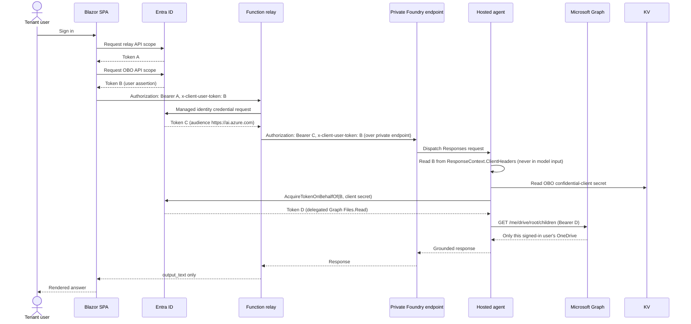

# Private (VNet-Injected) Deployment — Sequence and Steps

This document records the end-to-end sequence for standing up
`HostedOBOAgent` fully on a private network: VNet-injected Microsoft Foundry
(Standard Agent Setup), a private Key Vault, a jumpbox + Azure Bastion for
private access, the hosted Graph OBO agent, and the public relay/SPA.

Full narrative plan: see the fork's session plan; this file is the durable,
in-repo record of *what was run, in what order, and why*.

## 1. Deployment sequence (infra → app → validation)

```mermaid
sequenceDiagram
    actor Op as Operator (workstation)
    participant Az as Azure Resource Manager
    participant T15 as Template 15 (infra/foundry-private)
    participant Net as VNet + Private Endpoints
    participant Jump as Jumpbox VM (via Bastion)
    participant KV as Private Key Vault
    participant Entra as Microsoft Entra ID
    participant Agent as Hosted Graph OBO Agent
    participant Relay as Function Relay + SPA

    Op->>Az: 1. Preflight (providers, quota, RBAC, what-if)
    Op->>Az: 2. az deployment group create infra/foundry-private/main.bicep
    Az->>T15: 3. Provision VNet, subnets, Foundry account+project,\nCosmos DB, Storage, AI Search, private endpoints, DNS zones
    T15-->>Net: 4. Capability host bound to snet-agent
    Op->>Az: 5. az deployment group create infra/jumpbox/jumpbox.bicep
    Az-->>Jump: 6. Jumpbox VM + Bastion ready
    Op->>Entra: 7. Create SPA, relay API, OBO app registrations;\ngrant tenant admin consent on Graph Files.Read
    Op->>Az: 8. az deployment group create infra/private-keyvault.bicep\n(from the jumpbox, or with operatorObjectId pre-set)
    Az-->>KV: 9. Private Key Vault + OBO client secret
    KV-->>Agent: 10. Grant Foundry project MI: Key Vault Secrets User
    Op->>Jump: 11. RDP via Bastion
    Jump->>Az: 12. azd ai agent deploy (must run from inside the VNet)
    Az-->>Agent: 13. Hosted agent version active
    Op->>Az: 14. Deploy src/PublicChat/Relay/infra/main.bicep\n(Function relay + Static Web App)
    Az-->>Relay: 15. Relay + SPA live, granted Foundry Agent Consumer
    Jump->>Agent: 16. Private smoke test (Responses call over PE)
    Op->>Relay: 17. Browser E2E: sign in, ask for OneDrive folders
    Relay-->>Op: 18. Response scoped to signed-in user only
```

## 2. OBO token exchange (per-request, once everything is live)



| Token | Subject | Audience | Purpose |
| --- | --- | --- | --- |
| A | Signed-in user | Relay API | Authorizes the public `/api/chat` call |
| B | Signed-in user | OBO API app | User assertion forwarded via `x-client-user-token` |
| C | Relay managed identity | `https://ai.azure.com` | Lets the relay call the private Foundry endpoint |
| D | Signed-in user | Microsoft Graph | Delegated `Files.Read`, produced by the OBO exchange |

## 3. Repro steps (condensed)

1. **Preflight** — confirm Owner/User Access Administrator rights; register
   `Microsoft.KeyVault`, `Microsoft.CognitiveServices`, `Microsoft.Storage`,
   `Microsoft.Search`, `Microsoft.Network`, `Microsoft.App`,
   `Microsoft.ContainerService`; check `gpt-4.1-mini` quota in the target
   region; run `infra/deployment-tools/preflight`.
2. **Deploy the private Foundry foundation**:
   ```powershell
   az deployment group create -g <rg> -f infra/foundry-private/main.bicep -p infra/foundry-private/main.bicepparam
   ```
3. **Deploy the jumpbox + Bastion**:
   ```powershell
   az deployment group create -g <rg> -f infra/jumpbox/jumpbox.bicep -p infra/jumpbox/jumpbox.bicepparam adminPassword=$env:JUMPBOX_ADMIN_PASSWORD
   ```
4. **Create Entra registrations** (SPA, relay API, OBO confidential client)
   and grant tenant admin consent on delegated Graph `Files.Read`.
5. **Deploy the private Key Vault** and store the OBO client secret:
   ```powershell
   az deployment group create -g <rg> -f infra/private-keyvault.bicep -p vaultName=<kv> vnetName=vnet-hostedobo-wus3 privateEndpointSubnetName=snet-pe operatorObjectId=<id> oboClientSecret=$env:OBO_CLIENT_SECRET
   ```
6. **Deploy the hosted agent from inside the VNet** (RDP to the jumpbox via
   Bastion first):
   ```powershell
   azd env set AZURE_AI_MODEL_DEPLOYMENT_NAME gpt-4.1-mini
   azd env set KEY_VAULT_URL https://<kv>.vault.azure.net/
   azd env set APP_OBO_TENANT_ID <tenant>
   azd env set APP_OBO_CLIENT_ID <client>
   azd env set APP_OBO_CLIENT_SECRET_NAME APP-OBO-CLIENT-SECRET
   azd ai agent deploy
   ```
7. **Deploy the relay + SPA** from `src/PublicChat/Relay`:
   ```powershell
   azd deploy --no-prompt
   ```
8. **Validate**: private DNS resolution from the jumpbox, `401` from the relay
   with no token, `204` on CORS preflight, and a signed-in browser test asking
   `List my OneDrive root folders and their sizes.` — confirm the answer is
   scoped to that user only.

## Known operational gotchas

- Template 15 does **not** put agent *tools* behind the VNet; this agent calls
  Microsoft Graph directly so that's not needed here.
- A failed capability-host deployment leaves a `legionservicelink` on the
  agent subnet. Simplest retry: redeploy with a new VNet name.
- Every `azd`/`az`/SDK call against the project data plane must run from
  inside the VNet once `publicNetworkAccess` is `Disabled` — Foundry MCP
  tooling cannot reach it at all.
